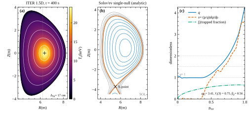
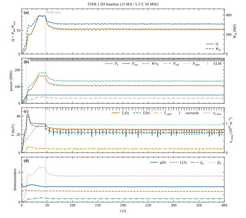

# Fusion Reactor Simulator

[](https://doi.org/10.5281/zenodo.22259861)
[](LICENSE)

> A time-resolved fusion reactor simulation engine: **0D** power balance and (new in v3.0)
> **1.5D radial transport coupled to a Grad–Shafranov equilibrium**. Tokamak, spherical tokamak,
> stellarator, laser ICF, MTF/MagLIF/Z-pinch, FRC, magnetic mirror and muon-catalysed fusion, with
> real-machine presets (ITER, JET, SPARC, DEMO, W7-X, NIF, …). Runs in the browser, no runtime
> dependencies beyond React.

The 1.5D model evolves T_e, T_i, n_e and the poloidal flux on ρ_tor, coupled to a fixed-boundary
Grad–Shafranov equilibrium, with Sauter bootstrap current, NBI/RF sources, beam–target fusion,
sawteeth, ELMs and NTMs. It is verified against manufactured solutions and validated against
ITER, JET DTE2, SPARC, EU DEMO and NIF. Publication-quality SVG/PDF figures and multi-core
parameter scans are built in.

<p align="center">
  
</p>

---

## What's new in v3.0

| Area | Change |
|---|---|
| **1.5D transport** | T_e, T_i, n_e, ψ on ρ̂ = √(Φ/Φ_b); implicit finite volume on an edge-packed radial grid, TR-BDF2 (second order, L-stable) with error control and event localisation, Anderson-accelerated Picard or Newton–Raphson (block-tridiagonal Jacobian) per stage, 2×2 block-tridiagonal T_e/T_i, Scharfetter–Gummel density flux, current diffusion in the Hinton–Hazeltine form (I_p as the boundary condition) |
| **Grad–Shafranov equilibrium** | Fixed boundary (Miller), Shortley–Weller finite differences, banded LU (factorised once), Picard; flux-surface tracing, exact trapped-particle fraction, q, ℓ_i, β_p, Shafranov shift; quasi-static coupling to transport |
| **Neoclassical** | Sauter bootstrap current and conductivity, Chang–Hinton ion floor |
| **Sources** | 3-component NBI beam attenuation + beam–target fusion, Gaussian ECRH/ICRH deposition, NBCD/ECCD |
| **MHD** | Kadomtsev sawtooth (shear-triggered), type-I ELM (α_crit + KBM), modified Rutherford NTM, L–H hysteresis |
| **Numerical verification** | GS 2nd order (2.05), FV heat 2nd order (1.94), backward Euler 1st order (0.99), DP5 vs RK4/Euler work–precision; 44 unit tests |
| **POPCON** | Same physics as the 0D model: dilution (Be/Ar/He ash), line + synchrotron radiation, loss power P_L = P_heat − P_rad,core (steady state; the 0D and 1.5D models also subtract dW/dt) |
| **Figures** | Dependency-free plotting engine → SVG + PDF (Times/Symbol, mini-TeX labels, Okabe–Ito palette, journal column widths); `npm run figures` |
| **Multi-core** | `worker_threads` pool: validation and parameter scans run in parallel |
| **User interface** | 0D/1.5D choice and 1.5D settings in the wizard, live radial profile plot, cross-section with GS flux surfaces, SVG/PDF figure export from the report, 1.5D validation test |

## Quick start

Requirements: Node.js 20+.

```bash
npm install
npm run dev        # user interface (Vite) → http://localhost:5173
npm test           # unit, CLI and fast golden-regression tests (vitest)
npm run validate   # 21 presets, 42 literature checks (7 documented known failures), on a worker pool (~45 s)
npm run golden     # golden regression: 30 cases compared with test/golden (~12 s on 4 threads)
npm run ci:local   # type check + schema check + tests + validate + golden + build + bundle budget, in sequence, stops at the first failure
npm run check:bundle  # after a build: fails when the main JS chunk is above 250 kB (85 kB gzip)
npm run figures    # paper figures → docs/figures/*.svg|pdf + captions.md (~1 MB, ~55 s)
npm run build      # type check + production build
npm run build:lib  # the library and the fusion-sim command line -> build/lib (ESM + CommonJS, declarations)
npm run schema     # regenerate schema/fusion-sim.schema.json (npm run schema:check verifies it is current)
```

Every command-line tool accepts `--help`, rejects unknown or malformed flags with exit code 2 and
takes `--threads N` (default: cores − 1).

- `validate`: `--only ITER15,JET15`, `--json` (machine-readable results: preset, metric, value,
  expected range, pass). Exit code 0 if every executed check passes, 1 if a check or run fails or
  no check was executed, 2 on a usage error. Plain `npm run` writes its `> script` banner to
  stdout before the JSON, so capture it silently:
  `npm run -s validate -- --json > results.json` (or `npx tsx src/cli/validate.cli.ts --json`).
- `figures`: `--only popcon,mhd`, `--scan 7` (scan grid), `--formats pdf`, `--out DIR`.
- `missions`: plays the ten missions of the Learn screen headless (untouched, with a negative control, with the
  solution script); exit code 0 if every mission is solvable and not trivial, `--only hmode,fuel`, `--json`.
- `golden`: `--only NIF,ITER15`; `--update` with `--reason TEXT` or `--reason-file FILE`. See
  [Regression testing](#regression-testing).
- `uq`: uncertainty quantification of a preset by an ensemble of full simulations (seeded Sobol' /
  Latin hypercube / Monte Carlo design, priors on H98, density, impurities and 1.5D profile
  settings): P(Q >= 10), P(disruption), P(n/n_G > 1), quantiles, rank correlations and, with
  `--analysis sensitivity`, Sobol' first-order and total indices with bootstrap intervals.
  `npm run -s uq -- --preset ITER --n 128 --json uq-iter.json`; the same `--seed` gives byte-identical
  JSON at any `--threads`. `scan`: parameter grid or sampled scan by full simulations
  (`--param H98=0.8:1.2:5`). `optimize`: design optimisation of a tokamak preset on the steady-state
  power balance (`--objective major-radius|plasma-volume|aux-power|fusion-power|gain`, `--pareto A,B`
  for a two-objective front). All three write JSON/CSV and carry an "educational" caveat; the
  library is in `src/analysis` (see its README).
- `fusion-sim` (`npx tsx src/cli/fusion-sim.ts <command>`, or `node build/lib/fusion-sim.js <command>` after
  `npm run build:lib`): `run` (one shot to json, csv, ndjson, netcdf or IMAS-like json), `scan` (a grid of
  parameter values on worker threads), `presets`, `schema` (print the JSON Schema of a configuration, or check a
  configuration file) and `export-eqdsk` (the G-EQDSK of a 1.5D run, COCOS 11). Every output
  carries a provenance block and is byte-identical for the same configuration. This `scan` runs a configuration
  scan; the `scan` above is the analysis one. See `src/cli/fusionSim/README.md`.
- Library: `src/physics/index.ts` is the public API (a documented barrel with `@public` and `@experimental`
  tags; browser-safe, no Node API), built by `npm run build:lib`; `src/io` has the browser-safe CSV, NDJSON,
  NetCDF-3 and IMAS-like writers and readers; every configuration is validated at run time with path-specific
  errors (`src/physics/config`, `schema/fusion-sim.schema.json`). `python/fusion_sim` wraps the command line.
- `npm run stress:exit -- 300 8` (opt-in soak): starts 300 `validate` and `golden` processes on
  fixture inputs (independent of the physics), 8 at a time, and checks that each ends with its
  documented exit code (0 or 1) and no signal. A short version of it is part of `npm test`.

## Validation summary

| Quantity | Reference | 0D | 1.5D |
|---|---|---|---|
| ITER Q (flat top) | 10 | 14.0 | **9.8** |
| ITER P_fus | 500 MW | 715 MW | **491 MW** |
| ITER f_bs / ℓ_i(3) / q95 | ≈0.2 / 0.85 / 3.0 | — | 0.22 / 0.73 / 3.5 |
| JET DTE2 E_fus | 59 MJ | 58 MJ | 85 MJ¹ |
| SPARC P_fus | 140 MW | 182 MW | 157 MW |
| EU DEMO P_fus | 2 GW | 2.2 GW | 1.95 GW |
| NIF N221204 gain | 1.54 | 1.49 | — |

¹ In 1.5D about 60 % of the fusion yield comes from NBI beam–target reactions (qualitatively
consistent with TRANSP analyses); the share is sensitive to the fast-ion slowing-down model.
Details: [technical report](docs/technical-report.md) §7.

<p align="center">
  
</p>

## Physics model

| Area | Model | Reference |
|---|---|---|
| Reactivity ⟨σv⟩ | Bosch–Hale (D-T, D-D, D-³He), numerical Maxwellian average for p-¹¹B | Bosch & Hale, *NF* **32** (1992) 611; Nevins & Swain (2000) |
| Confinement | IPB98(y,2), ITER89-P, ISS04, ST; L–H threshold (Martin 2008) | ITER Physics Basis (1999) |
| 1.5D transport | τ_E-scaled χ (PI controller) + critical-gradient stiffness, ETB, neoclassical floor; CGM alternative | METIS (Artaud 2018); Garbet (2004) |
| Equilibrium | Fixed-boundary Grad–Shafranov; Cerfon–Freidberg Solov'ev (verification) | Cerfon & Freidberg (2010); Jeon (2015) |
| Bootstrap / conductivity | Sauter–Angioni–Lin-Liu | *Phys. Plasmas* **6** (1999) 2834 |
| MHD events | Kadomtsev, α_crit ELM, modified Rutherford NTM | Kadomtsev (1975); La Haye (2006) |
| Radiation | Bremsstrahlung (relativistic), Albajar synchrotron, Mavrin line radiation | Albajar (2001); Mavrin (2018) |
| Edge | Two-point SOL model, Eich λ_q | Stangeby (2000); Eich (2013) |
| Limits / disruptions | Greenwald, Troyon β_N, q95; TQ/CQ, halo, runaway electrons | Greenwald (1988); Hender (2007) |
| Time integration | 0D: Dormand–Prince RK5(4); 1.5D: TR-BDF2 with error control, Anderson-accelerated Picard / Newton–Raphson | Hairer–Nørsett–Wanner |

Constants are CODATA 2018 and all internal calculations use SI units; simplifications are marked
with an `APPROXIMATION` tag in the code.

## Regression testing

Two independent safety nets guard the physics:

- **Literature validation** (`npm run validate`) checks selected outputs of every preset against
  published ranges. The ranges are wide: it catches order-of-magnitude and consistency errors.
- **Golden regression** (`npm run golden`) catches *any* numerical drift. For 30 cases (all 21
  presets, covering every method in 0D and 1.5D, a 3 s SPARC 1.5D variant, and 8 variants for
  what no preset uses: every fuel in 0D and 1.5D, 1.5D D-D and 1.5D spherical tokamak) it stores a
  deterministic snapshot in `test/golden/<case>.json`: every finite scalar of the shot report,
  flat-top averages of all diagnostics, whole-run minimum, maximum and mean of every diagnostic
  together with the number of frames in which it is missing or not finite (so a NaN anywhere in
  the run fails the check), event counts by kind, frame and step counts, 20 samples of 5–8 key
  time traces, the model geometry and, for 1.5D runs, every radial profile on the full ρ grid at
  mid-run and at the end plus a digest of the last Grad–Shafranov equilibrium. Numbers are
  compared with a relative tolerance of 1e-9 when the file was written by the same Node.js major
  version (1e-6 otherwise); a mismatch prints a table of preset, key, old value, new value and
  relative difference and exits with code 1. Long discharges are shortened (e.g. DEMO 600 s,
  DEMO15 500 s; recorded in each file) so the suite runs in about 12 s on 4 threads. `npm test`
  runs a fast subset (JET, NIF, Z, SPARC15-short).

When a change is *meant* to move the numbers, re-record them and say why:

```bash
npm run golden:update -- --reason "switch ELM model to …"        # all cases
npm run golden:update -- --reason "…" --only ITER15,DEMO15       # a subset
npm run golden:update -- --reason-file reason.txt                # a long reason from a file
```

This rewrites the affected files and appends a dated entry listing the moved presets and keys to
the append-only log [`test/golden/CHANGES.md`](test/golden/CHANGES.md). It refuses to run without
`--reason` or `--reason-file` (the two are mutually exclusive). In a `--reason-file` (UTF-8, LF or
CRLF) the first paragraph is the title of the entry and the further blank-line separated
paragraphs follow it, so a reason that does not fit on a Windows command line (`npm.cmd` rejects
a long `--reason`) can still list every headline move and its cause. For each changed case the
entry names the moved keys (largest relative change first), the added keys and the removed keys
under their own labels. A change of the file format is logged the same way: files of the previous
schema are compared too, so a format-only re-record reads "0 keys moved" plus the keys it added.

## Project layout

```
src/physics/
  confinement/        0D models (magnetic, icf, mtf, frc, mirror, muon) + shared shot report
  profiles/           1.5D model: geometry1d, fvsolver, neoclassical, sources, beamtarget, mhd, model, defaults
  equilibrium/        Grad–Shafranov: miller (boundary), solovev (analytic), gs (solver), fluxsurface (averages)
  numerics/           linalg (Thomas, block, banded LU), quadrature, interp (spline/PCHIP/bicubic), roots, rk4
  analysis/           flatTop (shared flat-top averaging)
  popcon.ts           Steady-state POPCON (same physics as 0D)
  integrator.ts       Dormand–Prince RK5(4)
  simulation.ts       Common driver (0D/1.5D selection, recording, rewind)
src/cli/              Node command-line tools: args (strict flag parser), pool (worker_threads),
                      presetRunner.worker, validate.cli (npm run validate), figures.cli (npm run figures),
                      golden.cli (npm run golden / golden:update), missions.cli (npm run missions), uq.cli / scan.cli / optimize.cli
                      (npm run uq / scan / optimize), fusion-sim (run | scan | presets | schema | export-eqdsk)
src/physics/index.ts  The public library API (barrel); src/physics/config: runtime validation, JSON Schema, dotted paths, runShot
src/io/               Browser-safe CSV, NDJSON, NetCDF-3 and IMAS-like writers and readers
src/analysis/         Uncertainty quantification and optimisation (samplers, Sobol' indices, ensembles, Nelder-Mead,
                      augmented Lagrangian, CMA-ES, NSGA-II); DOM-free, Node only in analysis/node
src/regression/       Golden snapshot extraction, comparator and pool worker
src/plot/             Plotting engine: figure, svg, pdf, png, mathtext, fonts, ticks, contour, colors
  figures/            Paper figures (equilibrium, profiles, timetrace, popcon, validation, reactivity, verification, mhd, scan, generic)
src/worker/, src/ui/  Web worker and React user interface
scripts/              ci-local (npm run ci:local), build-lib (npm run build:lib), gen-schema (npm run schema)
schema/               fusion-sim.schema.json, the JSON Schema of a configuration (generated)
python/               fusion_sim, a standard-library wrapper of the fusion-sim command line
test/golden/          Golden regression snapshots and their change log
docs/
  technical-report.md Technical report (equations, numerical methods, verification, validation, figures)
  figures/            Generated figures (SVG + PDF) and captions.md
```

## Resource usage

Simulations write no raw data or log files; history frames are kept at the regular output
interval and radial profiles are attached only to those frames. The whole figure set is about
1 MB. The worker pool uses `cores − 1` threads by default (limit it with `--threads`).

> **Scientific accuracy disclaimer:** this is a tool for education, pre-conceptual design and
> scenario exploration; it is not a full free-boundary, turbulence or nonlinear MHD code. Its
> limitations are listed in §11 of the technical report. It must not be used as a primary source
> for machine design.

## Citation

If you use this project, please cite it with the information in `CITATION.cff` (**"Cite this
repository"** on GitHub). Concept DOI covering all versions:
[10.5281/zenodo.22259861](https://doi.org/10.5281/zenodo.22259861). DOI of v3.0.0:
[10.5281/zenodo.22925078](https://doi.org/10.5281/zenodo.22925078).

## License

[MIT](LICENSE) © 2026 Mustafa Karatum
