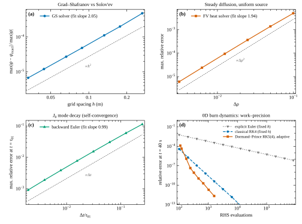
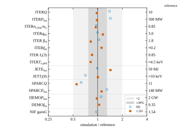
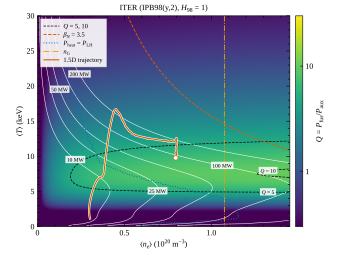
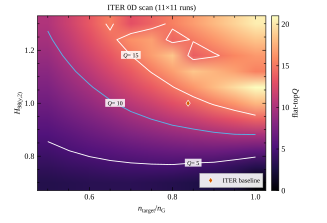
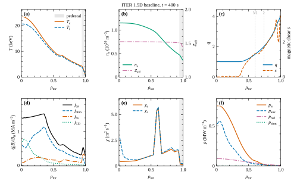
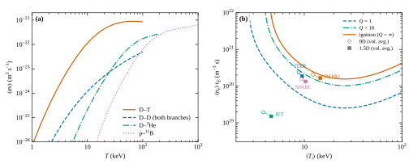
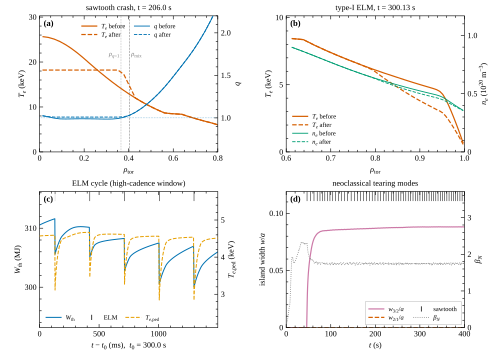

# Füzyon Reaktörü Simülatörü — Teknik Rapor (v3.0)

**Yazar:** Mustafa Karatum  <!-- TODO: ismini/ORCID'ini doğrula -->
**Sürüm:** 3.0.0
**Tarih:** 23 Eylül 2026
**Lisans:** MIT (kod), CC-BY-4.0 (bu rapor önerilir)
**Kavram DOI:** [10.5281/zenodo.22259861](https://doi.org/10.5281/zenodo.22259861)
**Sürüm DOI (v3.0.0):** [10.5281/zenodo.22925078](https://doi.org/10.5281/zenodo.22925078)

---

## Özet

Bu rapor, tarayıcıda ve Node.js'te çalışan, bağımlılıksız (yalnız TypeScript) bir füzyon
reaktörü simülasyon motorunun 3.0 sürümünü tanımlar. Motor iki doğruluk düzeyi sunar:
(i) mevcut **0D** hacim-ortalamalı güç/parçacık dengesi (uyarlanır Dormand–Prince RK5(4));
(ii) bu sürümde eklenen **1.5D** model: normalize toroidal akı koordinatı ρ̂ = √(Φ/Φ_b)
üzerinde elektron/iyon sıcaklığı, elektron yoğunluğu ve poloidal akı için örtük sonlu-hacim
taşınım çözücüsü, periyodik olarak güncellenen **sabit-sınırlı Grad–Shafranov (GS)** dengesi,
Sauter neoklasik bootstrap/iletkenlik, NBI/ECRH/ICRH kaynak profilleri, demet-hedef füzyonu
ve olay-tabanlı MHD (Kadomtsev testere dişi, tip-I ELM, modifiye Rutherford NTM). Kod
doğrulaması (verification) üretilmiş çözümlerle yapılmıştır: GS çözücüsü ikinci derece
(gözlenen 2.05), sonlu-hacim ısı çözücüsü ikinci derece (1.94), geri-Euler birinci derece
(0.99). Geçerlilik (validation) ITER, JET DTE2, SPARC, EU DEMO ve NIF için yayımlanmış
değerlere karşı yapılmış; 1.5D ITER taban senaryosu düz tepede Q = 9.8, P_fus = 491 MW,
f_bs = 0.22, ℓ_i(3) = 0.73, q95 = 3.5 vermektedir. Yayın kalitesinde vektör figürler (SVG/PDF)
bağımlılıksız bir çizim motoruyla üretilir; parametre taramaları çok çekirdekli işçi
havuzunda koşar. Tüm çıktılar küçük boyutludur (9 figür ≈ 1 MB; ham veri diske yazılmaz).

*Abstract (EN).* We describe version 3.0 of a dependency-free TypeScript fusion reactor
simulator. Besides the 0D volume-averaged power balance, it now provides a 1.5D transport
model on the normalised toroidal-flux coordinate with implicit finite-volume solvers for
T_e, T_i, n_e and the poloidal flux, a fixed-boundary Grad–Shafranov equilibrium solver
(Shortley–Weller finite differences, banded LU, Picard iteration, exact flux-surface
averages and trapped fraction) coupled quasi-statically to transport, Sauter bootstrap
current and conductivity, NBI/RF source profiles with beam–target fusion, and event-based
MHD (sawteeth, type-I ELMs, NTMs). Verification against manufactured solutions shows the
expected orders of accuracy; validation against ITER, JET DTE2, SPARC, EU DEMO and NIF
reference values is summarised in Fig. 5. Publication-quality SVG/PDF figures are produced
by a built-in plotting engine; scans run on a worker-thread pool.

**Anahtar kelimeler:** nükleer füzyon, tokamak, taşınım modellemesi, Grad–Shafranov dengesi,
bootstrap akımı, MHD olayları, POPCON, sayısal doğrulama.

---

## 1. Giriş ve kapsam

Tam taşınım kodları (TRANSP, JINTRAC, ASTRA, CRONOS/METIS, TORAX) tokamak senaryolarını
yüksek doğrulukla modeller; ancak kurulum ve hesap maliyetleri yüksektir. 0D sistem kodları
ise tasarım uzayını hızlı tarar ama profil fiziğini (bootstrap akımı, pedestal, akım
difüzyonu, q profili, MHD tetikleyicileri) içeremez. v3.0, bu iki uç arasında **tarayıcıda
saniyeler içinde** koşan, izlenebilir ve doğrulanmış bir 1.5D katman ekler.

Tasarım ilkeleri (v2'den devralınan): her bağıntının kaynağı kodda; iç hesaplar SI; tüm
basitleştirmeler `APPROXIMATION` etiketli; stokastik olaylar tohumlu PRNG ile belirlenimci.
v3'te eklenen ilkeler: **(i)** her sayısal yöntem üretilmiş/analitik çözümle birim testte
doğrulanır; **(ii)** küresel dinamik doğrulanmış 0D ölçeklemesiyle tutarlı kalır, profil
*şekli* fizikten çıkar; **(iii)** disk ve bellek dostu çıktı (bkz. §9).

## 2. Model mimarisi

```
                ┌───────────── Simulation (ortak sürücü: zaman, kayıt, olaylar, geri sarma) ─────────────┐
 fidelity='0D'  │ MagneticModel: y = [W_e, W_i, n_a, n_b, n_He, n_Z, W_f, I_p, …]  → DormandPrince RK5(4) │
 fidelity='1.5D'│ ProfileModel: y = [T_e(ρ), T_i(ρ), n_e(ρ), ψ(ρ), skalerler] → örtük FV adımı (model.step) │
                │      ↕ yarı-statik bağlaşım (p(ψ_N), ⟨j_φ/R⟩(ψ_N) → GS → V′, g1, g2, F, ⟨R⁻²⟩, f_t, q)   │
                │   GSSolver (sabit sınır, Miller LCFS)                                                   │
                └──────────────────────────────────────────────────────────────────────────────────────────┘
```

1.5D model yalnız tokamak ve sferik tokamak için etkindir (`supportsProfiles`); stellarator
0D kalır. Her iki model aynı `SimModel` arayüzünü uygular; arayüz, rapor, karşılaştırma ve
doğrulama araçları iki modeli de şeffaf biçimde kullanır. Durum 1.5D'de 4N + 15 bileşenlidir
(N = 50 radyal hücre varsayılanı): dört profil ve He külü envanteri, safsızlık oranı, yakıt
karışımı, enerji/nötron sayaçları, taşınım çarpanı C_χ ve integral durumu, I_p, NTM ada
genişlikleri (3/2, 2/1) ve ELM enerji darbesi.

## 3. 1.5D taşınım modeli

### 3.1 Koordinat ve metrik

Taşınım koordinatı ρ̂ = √(Φ/Φ_b)'dir. GS dengesinden ψ_N → ρ̂ dönüşümü dΦ = 2π q dψ ile
kurulur; metrik katsayılar

```
V′ = dV/dρ̂,   g1 = ⟨|∇ρ̂|²⟩,   g2 = ⟨|∇ρ̂|²/R²⟩,   ⟨|∇ρ̂|⟩,   F = R B_φ,   ⟨R⁻²⟩,   f_t
q = Φ_b ρ̂ / (π ∂ψ/∂ρ̂)
```

akı-yüzeyi ortalamalarından (§4.3) hesaplanır ve hücre-merkezli ızgaraya
(ρ̂_i = (i+½)Δρ, yüzeyler ρ̂_{i+½}) eşlenir. Eksende düzenli büyüklükler (V′/ρ̂, g1, g2)
kübik spline ile interpolasyon yapılır. Birim testlerde analitik çözümler için silindirik
yedek geometri (`circularGeometry`) kullanılır.

### 3.2 Yönetici denklemler

```
(3/2) ∂(n_e T_e)/∂t = (1/V′) ∂ρ[ V′ g1 n_e χ_e ∂ρT_e − (5/2) T_e Γ ] + Q_e − (3/2) n_e ν_eq (T_e − T_i)
(3/2) ∂(n_i T_i)/∂t = (1/V′) ∂ρ[ V′ g1 n_i χ_i ∂ρT_i − (5/2) T_i Γ ] + Q_i + (3/2) n_e ν_eq (T_e − T_i)
∂n_e/∂t            = −(1/V′) ∂ρ Γ + S,          Γ = V′( −g1 D ∂ρn_e + ⟨|∇ρ̂|⟩ v n_e )
σ∥ F ⟨R⁻²⟩ ∂ψ/∂t   = (1/(μ0 V′)) ∂ρ( V′ F g2 ∂ρψ ) − ⟨j_ni·B⟩
```

Q_e, Q_i: α ısıtması (Stix kritik enerjisiyle iyon/elektron paylaşımı), NBI, ICRH, ECRH,
ohmik (η_neo j²), radyasyon (yerel bremsstrahlung, Mavrin çizgi soğuması, senkrotron);
j_ni = j_bs + j_CD.

**Sınır koşulları.** Eksende simetri (V′ = 0 ⇒ akı sıfır). Dış sınırda T_e = T_i = T_sep
iki-nokta modelinden (Stangeby): `T_u = (7 q∥ L∥ / 2κ0e)^{2/7}`, `q∥ = P_SOL B/(2π R λ_q B_p)`,
λ_q Eich (2013) ölçeklemesi; n_sep = f_sep ⟨n_e⟩ (gaz beslemesinde yoğunluk hedefi için
kazançlı denetleyici); ψ için akım koşulu (Neumann): ∂ψ/∂ρ̂|_LCFS enclosed I_p'yi verir.

### 3.3 Taşınım katsayıları

İki mod vardır. **'scaling' (varsayılan, doğrulanmış):**

```
χ_e(ρ) = C_χ(t) · (1 + c ρ²) · S(R/L_Te),    χ_i = (χ_i/χ_e) · C_χ(t) · (1 + c ρ²) · S(R/L_Ti)
S(x)   = 1 + stiffness · min(max(x/x_crit − 1, 0), 5)        (yalnız ρ < 0.85; ITG/TEM sertliği)
```

C_χ bir **PI denetleyicisiyle** depolanan enerjiyi ölçekleme hedefine çeker:
W → τ_T · P_L, τ_T = H98·τ_IPB98(P_L)·f_NTM (H-kipi; L-kipinde ITER89-P). Kayıp gücü
P_L = P_ısıtma − P_rad,çekirdek − dW/dt'dir (çekirdek: ρ < 0.6; dW/dt τ_E ile süzülür ve ELM
kayıplarını içerir; 0D modelle aynı tanım). İntegral
terimi, difüzyon tahmini C_est = a²κ_a/(6 τ (1 + c/2)) çevresinde [0.1, 10]·C_est ile
sınırlanır (anti-windup). Böylece küresel dinamik doğrulanmış 0D ölçeklemeyle tutarlı kalır;
profil **şekli** ise kaynak birikimi, sertlik, pedestal, testere dişi, bootstrap ve akım
difüzyonundan fiziksel olarak çıkar (METIS/CRONOS "τ_E-ölçekli" yaklaşımı). **'cgm':**
kritik-gradyan modeli χ_i = q^{3/2} χ_gB (R/L_Ti − 4.5)² + … (Garbet et al. 2004;
öngörücü, kalibrasyonsuz — deneysel).

Ek katkılar: (i) **ETB** (H-kipinde pedestal içinde χ → etbFactor·χ, tanh geçişi);
pedestal gradyanı kinetik balonlama (KBM) sınırını aşarsa bastırma gevşer (EPED resmi);
(ii) **neoklasik iyon tabanı** (Chang–Hinton biçimi); (iii) **NTM adası**: ada genişliği
içinde χ artışı (profil düzleşmesi); (iv) D = (D/χ_e)·χ_e, iç pinç v = −2 P_n D ρ g1/⟨|∇ρ|⟩
(kaynaksız kararlı durumda n ∝ exp(−P_n ρ²), P_n α_n'den çözülür).

### 3.4 Kaynaklar ve akım sürme

* **NBI:** orta-düzlemde teğet kiriş (R_tan) boyunca demet zayıflaması
  dI/dℓ = −n_e σ_s I (Janev–Boley–Post eğilimi), üç enerji bileşeni (E, E/2, E/3),
  shine-through; **demet-hedef füzyonu** yavaşlama dağılımı üzerinden önbellekli tablo
  ⟨σv⟩_bt(E_c, T_i) ile.
* **ECRH/ICRH:** Gauss birikimi (hacim-normalize; ışın izleme yok — APPROXIMATION).
* **Akım sürme:** γ = n_e[10²⁰] R I_CD/P verimleri (NBCD, ECCD), T_e ölçekli.
* **α ısıtması:** yerel füzyon gücü (Bosch–Hale), Stix paylaşımı; He külü envanteri
  τ_He = (τ_He/τ_E)·τ_E ile.

### 3.5 Neoklasik fizik

Sauter–Angioni–Lin-Liu (1999; 2002 düzeltmesi) bağıntıları: neoklasik iletkenlik σ_neo
(f_t, ν*_e), bootstrap akımı ⟨j_bs·B⟩ = σ katsayıları × (∂p/∂ψ, ∂T_e/∂ψ, ∂T_i/∂ψ). Tuzaklı
parçacık oranı dengeden **tam** hesaplanır (§4.3).

### 3.6 MHD olayları

* **Testere dişi:** q = 1 yüzeyindeki kayma s₁ > s_crit (Porcelli tetikleyicisinin kayma
  biçimi). Çöküş: Kadomtsev tam yeniden bağlanması — helisel akı ψ*(ρ) = ∫₀^ρ (1/q − 1) dΦ/2π
  korunur, karışım yarıçapı ψ*(ρ_mix) = ψ*(0); ρ_mix içinde T_e, T_i, n_e enerji/parçacık
  korunarak düzleşir, q → max(q, 1.01). Çöküş, NTM tohumu verir (Şekil 8a).
* **Tip-I ELM:** pedestal normalize basınç gradyanı α = 2μ0 R q² |∂p/∂r|/B² kritik değeri
  α_crit·(1 + κ²(1+5δ²))/2 aşınca pedestal ΔW/W_ped oranında çöker; bekleme süresi τ_E/8
  (deneysel f_ELM τ_E ≈ 5–30). ITER tabanında f_ELM ≈ 2.6 Hz (Şekil 8c).
* **NTM:** modifiye Rutherford denklemi (La Haye 2006):
  `dw/dt = 1.22 (η/μ0) [ Δ′₀ + a_bs √ε β_θ (L_q/L_p) w/(w² + w_d²) − a_pol w_d²/w³ ]`;
  hapsetmeye etkisi kuşak modeliyle f_NTM = 1 − 4 Σ ρ_s² w/a.
* **L–H geçişi:** P_L ≥ P_LH; Martin (2008) eşiği + Ryter (2014) düşük yoğunluk kolu (çizgi-ortalama
  yoğunlukla), 0.7 histerezisli.
* **Kararlılık teşhisi:** Mercier D_M ve s–α balonlama sınırı (Connor–Hastie–Taylor) profilleri.

## 4. Grad–Shafranov dengesi

### 4.1 Denklem ve ayrıklaştırma

```
Δ*ψ ≡ R ∂R(R⁻¹ ∂Rψ) + ∂²Zψ = −μ0 R² p′(ψ) − F F′(ψ)
```

Sabit sınır: Miller LCFS `R = R0 + a cos(θ + arcsin δ sin θ)`, `Z = κ a sin θ`. Dikdörtgen
(R, Z) ızgarası; iç düğümlerde standart 5-noktalı şablon, sınıra komşu düzensiz düğümlerde
**Shortley–Weller** şablonu (ızgara çizgisi boyunca sınıra gerçek uzaklıklarla), Dirichlet
ψ = 0. Bant genişliği N_R olan seyrek sistem **bir kez LU çarpanlarına ayrılır**
(pivotsuz bantlı LU); her Picard iterasyonunda yalnız geri yerine koyma yapılır. Sınır
dışındaki 64 katman ψ değeri ekstrapole edilir (bikübik spline'ın LCFS yakınında
salınımsız kalması için).

### 4.2 Profil modları ve Picard iterasyonu

* **'shape'** (Jeon 2015 / FreeGS): j_φ = λ[β0 R/R0 + (1−β0) R0/R](1 − ψ_N^αm)^αn; λ I_p'den,
  β0 hedef β_p'den.
* **'table'** (taşınım bağlaşımı): p(ψ_N) ve ⟨j_φ/R⟩(ψ_N) tabloları;
  FF′ = μ0 (⟨j_φ/R⟩ − p′)/⟨R⁻²⟩. ⟨j_φ/R⟩ biçimi, I(ψ_N) biçimine göre kararlıdır
  (eksen kayması geri beslemesi olmadan 6–10 iterasyonda yakınsar).

Picard iterasyonu gevşetmeli (ω = 0.9), bağıl artık < 10⁻⁵; önceki denge sıcak başlangıç
olarak kullanılır. Manyetik eksen bikübik spline gradyanında Newton ile bulunur.

### 4.3 Akı yüzeyleri ve ortalamalar

Yüzeyler eksenden çıkan 128 ışın boyunca ψ_N seviyesinin Hermite ters çevirmesi + bikübik
spline üzerinde Newton ile izlenir. Hesaplanan büyüklükler: V, dV/dψ, alan, I(ψ),
⟨R⁻²⟩, ⟨R⁻¹⟩, ⟨|∇ψ|²/R²⟩, ⟨|∇ψ|²⟩, ⟨|∇ψ|⟩, ⟨B²⟩, B_min/max, q = (F/2π)∮ dl/(R|∇ψ|),
elongasyon/üçgensellik, toroidal akı Φ ve ρ_tor. Tuzaklı oran tam formülle:
`f_t = 1 − (3/4)⟨B²⟩ ∫₀^{1/B_max} λ dλ / ⟨√(1 − λB)⟩`. Küresel büyüklükler: β_t, β_p, β_N,
ℓ_i(3) = 2∫B_p² dV/(μ0² I_p² R0), q95, Shafranov kayması (R_ax − R_geo, R_geo = LCFS'nin
(R_max + R_min)/2'si).

### 4.4 Taşınım ile bağlaşım

Denge, en geç `eqUpdateInterval`'da bir (varsayılan t_son/20, [0.5, 20] s) veya β_p %10 ya
da ℓ_i %5 değişince (en az ¼ aralıkla) güncellenir. Yeni metrik katsayılar ρ̂ ızgarasına
yeniden eşlenir. ITER 400 s atışında 23 güncelleme yapılır (≈ 50 ms/güncelleme).

## 5. Sayısal yöntemler

| Bileşen | Yöntem | Not |
|---|---|---|
| 1.5D ısı | TR-BDF2 (2. mertebe, L-kararlı; v3'te geri Euler) + Anderson hızlandırmalı Picard veya Newton–Raphson | T_e/T_i 2×2 blok üçlü-köşegen, eşitlenme örtük; kenara sıkıştırılmış ρ̂ ızgarası |
| 1.5D yoğunluk | geri Euler, Scharfetter–Gummel akısı B(x) = x/(eˣ − 1) | konveksiyon–difüzyon için pozitiflik |
| 1.5D akım | TR-BDF2, Hinton–Hazeltine biçimi, sınır koşulu I_p | döngü gerilimi V_loop = 2π ∂ψ_b/∂t |
| Zaman adımı | uyarlanır: gömülü hata tahmini (rtol 10⁻², atol 10⁻⁴) ve integral adım denetleyicisi, Δt ≤ 0.5 s (v3'te profil değişimi ≤ %8 kuralı) | ELM ve testere dişi çöküşü eşik geçişine Brent ile yerelleştirilir; çöküşten sonra Δt = 0.5 ms |
| GS | Shortley–Weller FD + bantlı LU + Picard | Bölüm 4 |
| 0D ODE | Dormand–Prince RK5(4), gömülü hata tahmini | Hairer–Nørsett–Wanner |
| İnterpolasyon | kübik spline, PCHIP, bikübik (Hermite) | `numerics/interp.ts` |
| Kök bulma | Brent, monoton ters çevirme | `numerics/roots.ts` |
| Karşılaştırma | sabit adımlı RK4 ve açık Euler | yalnız doğrulama (`numerics/rk4.ts`) |

## 6. Kod doğrulaması (verification)



**Şekil 7.** (a) GS çözücüsü, Cerfon–Freidberg Solov'ev tam çözümüne karşı: gözlenen derece
**2.05**. (b) Sonlu-hacim ısı çözücüsü (silindirde düzgün kaynak, T ∝ 1 − ρ²): **1.94**.
(c) Geri-Euler, J₀(j₀₁ρ) kipinin sönümü (öz-yakınsama): **0.99**. (d) 0D D–T yanma dinamiği
test problemi (α ısıtması, güç bozunumlu τ_E ∝ P^−0.69, bremsstrahlung, modüle besleme) için
iş–hassasiyet: uyarlanır DP5(4) 10⁻¹² bağıl hataya ≈ 2×10³ sağ-taraf çağrısıyla ulaşır; sabit
adımlı RK4 ≈ 10⁴ çağrı gerektirir; açık Euler 8×10⁵ çağrıda ancak ≈ 10⁻⁶'ya iner. Bu, 0D
modellerde RK4/Euler yerine uyarlanır gömülü RK çiftinin tercihini nicel olarak gerekçelendirir.

Birim testleri (`npm test`, 44 test): Thomas/blok üçlü-köşegen/bantlı LU, Gauss–Legendre,
spline/PCHIP/bikübik türevleri, Brent; RK4 (4. derece) ve Euler (1. derece); Solov'ev
çözümünün GS denklemini ve sınır koşullarını sağlaması, tek-null X-noktası (eyer), GS ikinci
derece yakınsama, ITER dengesinin integralleri (I_p, V, A, q–⟨R⁻²⟩ özdeşliği), tablo
modunun kendi çıktısını yeniden üretmesi; ısı çözücüsünün O(Δρ²) doğruluğu, eşitlenmenin
enerji korunumu, pinçli yoğunluk kararlı durumu, akım difüzyonunun j ∝ σ'ya gevşemesi;
Spitzer iletkenliği, bootstrap işareti; Kadomtsev karışım yarıçapı ve korunum; ITER/JET 1.5D
entegrasyon ve geri sarma belirlenimciliği; çizim motoru (kontur, işaretler, mathtext,
SVG/PDF yapısı ve xref ofsetleri) ve POPCON tutarlılığı.

## 7. Geçerlilik (validation)

`npm run validate`, 25 preset'i işçi havuzunda paralel koşar ve 19 ölçütü yayımlanmış
aralıklara karşı denetler (tümü geçer). Şekil 5 ve tablo, 0D ve 1.5D sonuçlarının
referansa oranını verir (düz tepe = atışın son %30'u).



| Büyüklük | Referans | 0D / ref | 1.5D / ref |
|---|---|---|---|
| ITER Q | 10 (Shimada 2007) | 1.40 | 0.98 |
| ITER P_fus | 500 MW | 1.43 | 0.98 |
| ITER n̄_e/n_G | 0.85 | 0.96 | 0.95 |
| ITER q95 | 3.0 | 1.00 | 1.16 |
| ITER β_N | 1.8 | 1.04 | 0.82 |
| ITER f_bs | ≈ 0.2 (Sips 2005) | — | 1.12 |
| ITER ℓ_i(3) | 0.85 | — | 0.85 |
| ITER T_e,ped | ≈ 4.5 keV (EPED) | — | 0.82 |
| JET E_fus | 59 MJ (DTE2 #99971) | 0.99 | 1.43 |
| JET T_i(0) | ≈ 10 keV | 0.71 | 1.01 |
| SPARC Q | 11 (Creely 2020) | 0.63 | 0.55 |
| SPARC P_fus | 140 MW | 1.30 | 1.12 |
| DEMO P_fus | 2 GW (Siccinio 2020) | 1.10 | 0.98 |
| DEMO f_bs | 0.35 | — | 1.04 |
| NIF kazanç G | 1.54 (N221204) | 0.97 | — |

**Yorum.** 1.5D model ITER'de 0D'nin Q ≈ 14 aşırı tahminini Q ≈ 9.8'e indirir: 3/2 NTM
(testere dişi tohumlu, doyum w/a ≈ 0.084) ve profil etkileri (pedestal, akım difüzyonu)
hapsetmeyi düşürür. **JET +%43:** 1.5D'de füzyonun ≈ %60'ı üç-bileşenli NBI'nin demet-hedef
reaksiyonlarından gelir (TRANSP analizleriyle nitel uyumlu); bu pay hızlı iyon yavaşlama
modeline duyarlıdır ve modelin bilinen bir sınırlamasıdır. SPARC'ta her iki model de
Q ≈ 11 tasarım tahmininin altındadır (yalnız ICRH, W safsızlığı ve H98 = 1 varsayımları).

## 8. POPCON ve parametre taraması

POPCON (Houlberg–Attenberger–Hively 1982), 0D modelle **aynı fiziği** kullanır: yarı-nötrallikten
yakıt seyrelmesi (ana safsızlık, tohum, öz-tutarlı He külü n_He = R_füz τ_He/V), bremsstrahlung
+ Mavrin çizgi + Albajar senkrotron ışınımı, P_L = P_heat − P_rad,çekirdek'te (dW/dt = 0) değerlendirilen
H98·IPB98(y,2). Kararlı durum P_L = W/τ_E(P_L) + P_rad,manto sabit-nokta iterasyonuyla (τ ∝ P^−0.69 ⇒
yakınsak) çözülür; `P_aux = W/τ_E + P_rad − P_α`. Bu tutarlılık sayesinde 1.5D atışın son
durumu (⟨n_e⟩ ≈ 0.8×10²⁰ m⁻³, ⟨T⟩ ≈ 9.5 keV) POPCON'da Q ≈ 9 bölgesine düşer (Şekil 4) —
basit (seyreltmesiz) POPCON'un aksine ITER'de ateşlenmiş bölge yoktur.

  

**Şekil 9:** ITER 0D modelinin H98 × n/n_G uzayında 121 bağımsız 150 s atışla taranması
(işçi iş parçacığı havuzunda paralel; her atış bağımsız).

## 9. Başarım ve kaynak yönetimi

| İş | Süre (duvar) | Not |
|---|---|---|
| ITER 1.5D, 400 s, N = 50, 23 GS güncellemesi | ≈ 4.5 s (tek çekirdek) | ~10⁴ örtük adım |
| EU DEMO 1.5D, 2000 s | ≈ 40 s | en uzun görev |
| `npm run validate` (25 preset) | ≈ 45 s | 11 işçi; uzun görevler önce |
| `npm run figures` (9 figür + 121 atış) | ≈ 55 s | ITER ana iş parçacığında, diğerleri havuzda |
| GS güncellemesi (49×91) | ≈ 50 ms | LU bir kez; Picard 6–10 iterasyon |

**Disk ve bellek.** Ham veri veya log dosyası yazılmaz. Geçmiş kareleri düzenli çıktı
aralığında (t_son/800) tutulur; profiller yalnız düzenli karelere eklenir; işçiler ana
iş parçacığına yalnız rapor ve son-%30 ortalamalarını gönderir (IPC dostu). Tüm figür seti
(18 dosya, SVG + PDF) ≈ 1.0 MB'tır. Worker havuzu `availableParallelism() − 1` iş parçacığı
kullanır (`--threads` ile sınırlandırılabilir).

**Performans iyileştirmeleri.** Adım başına sabitlerin önbelleklenmesi (0.39 → 0.048 ms/çağrı),
GS dış-katman ekstrapolasyon planının önbelleklenmesi (135 → 50 ms/güncelleme), demet-hedef
reaktivite tablosu (~100×), bantlı LU'nun bir kez çarpanlara ayrılması, ön-tahsisli
`Float64Array` çalışma dizileri (adım içinde tahsis yok).

## 10. Yayın kalitesinde figürler

`src/plot/` bağımlılıksız bir çizim motorudur: görüntü listesi → SVG ve PDF 1.4 (standart-14
Type 1 yazı tipleri Times/Symbol, FlateDecode, saydamlık), mini-TeX etiketleri (italik
değişkenler, düz alt simgeler, Yunan harfleri), marching-squares konturları, viridis/magma/
inferno/RdBu renk haritaları, Okabe–Ito renk-körü dostu palet, dergi sütun genişlikleri
(tek sütun 3.37 in, çift sütun 7.0 in), içe dönük dört-kenar çentikleri. `npm run figures`
Şekil 1–9'u `docs/figures/` altına yazar; `captions.md` şekil altyazılarını ve güncel sayıları
içerir. **Dergi gönderimi için** yazı tiplerini gömmek: `gs -dNOPAUSE -dBATCH -sDEVICE=pdfwrite
-dEmbedAllFonts=true -dSubsetFonts=true -sOutputFile=out.pdf in.pdf`.

Arayüzden de (Rapor ekranı) herhangi bir atış için zaman izleri, 1.5D profiller ve GS kesiti
SVG/PDF olarak dışa aktarılabilir (grafik kütüphanesi tıklamada tembel yüklenir).


**Şekil 1.** (a) ITER 1.5D dengesi (t = 400 s), T_e renkli; (b) Cerfon–Freidberg tek-null
Solov'ev dengesi (ayırıcı, X-noktası, SOL); (c) q, s ve tam f_t profilleri.



**Şekil 2.** Düz tepe radyal profilleri: sıcaklıklar ve pedestal, yoğunluk ve Z_eff, q ve
kayma (rasyonel yüzeyler), akım bileşenleri, χ_e/χ_i, güç yoğunlukları.


**Şekil 3.** ITER 1.5D atışının zaman izleri: L–H geçişi (≈ 6.5 s), testere dişi tohumlu 3/2
NTM başlangıcı (≈ 81 s) ve sonrasında Q ≈ 10 düz tepe; 1022 tip-I ELM, 24 testere dişi.



**Şekil 6.** (a) Reaktiviteler (fitler yalnız geçerlilik aralıklarında); (b) Lawson diyagramı
(Q = 1, 10, ∞) ve benzetimlerin çalışma noktaları.



**Şekil 8.** MHD olayları: testere dişi çöküşü (ρ_{q=1}, ρ_mix), tip-I ELM pedestal çöküşü,
2 ms örneklemeli ELM döngüsü, NTM ada genişlikleri.

## 11. Sınırlamalar

* **Sabit sınır:** LCFS Miller biçimindedir; serbest-sınır denge, bobin akımları ve X-noktalı
  gerçek ayırıcı taşınım hesabında yoktur (Solov'ev tek-null yalnız doğrulama/gösterim içindir).
* **Taşınım kapanışı:** 'scaling' modu genliği ölçeklemeye kısıtlar — öngörücü değildir;
  'cgm' kalibrasyonsuzdur. Türbülans (TGLF/QLKNN) modeli yoktur.
* **Kaynaklar:** RF için ışın izleme, NBI için Monte-Carlo hızlı iyon (NUBEAM) yoktur;
  demet-hedef payı (JET) yavaşlama modeline duyarlıdır.
* **MHD:** olay-tabanlı indirgenmiş modeller; doğrusal olmayan MHD, RWM, kilitli mod dinamiği yok.
* **Kenar:** iki-nokta SOL; divertör ayrılması (detachment) ve nötral taşınımı yok.
* Sonuçlar eğitim, ön-tasarım ve senaryo keşfi içindir; makine mühendisliği kararları için
  birincil kaynak değildir.

## 12. Yeniden üretilebilirlik

```bash
npm install
npm test            # 44 birim testi (vitest)
npm run validate    # 25 preset, 19 literatür ölçütü (işçi havuzu; --threads N, --only ITER15,JET15)
npm run figures     # docs/figures/*.svg|pdf + captions.md (--only popcon,mhd; --scan 7; --formats pdf)
npm run dev         # etkileşimli arayüz (Vite)
npm run build       # tip denetimi + üretim derlemesi
```

Her atış, yapılandırma + tohum ile bit düzeyinde yeniden üretilebilir (ELM/testere dişi
dizileri dahil); geri sarma sonrası devam belirlenimcidir (birim testte doğrulanır).

## Kaynakça

1. H.-S. Bosch, G. M. Hale, *Nucl. Fusion* **32** (1992) 611 — füzyon tesir kesitleri ve reaktiviteler.
2. W. M. Nevins, R. Swain, *Nucl. Fusion* **40** (2000) 865 — p–¹¹B reaktivitesi.
3. ITER Physics Expert Groups, *Nucl. Fusion* **39** (1999) 2175 — IPB98(y,2).
4. M. Shimada *et al.*, *Nucl. Fusion* **47** (2007) S1 — ITER fizik temeli ilerlemesi (Q = 10 tabanı).
5. O. Sauter, C. Angioni, Y. R. Lin-Liu, *Phys. Plasmas* **6** (1999) 2834; düzeltme **9** (2002) 5140.
6. B. B. Kadomtsev, *Sov. J. Plasma Phys.* **1** (1975) 389 — testere dişi yeniden bağlanması.
7. F. Porcelli, D. Boucher, M. N. Rosenbluth, *Plasma Phys. Control. Fusion* **38** (1996) 2163.
8. R. J. La Haye, *Phys. Plasmas* **13** (2006) 055501 — NTM'ler ve denetimi.
9. P. B. Snyder *et al.*, *Phys. Plasmas* **16** (2009) 056118 — EPED pedestal modeli.
10. J. W. Connor, R. J. Hastie, J. B. Taylor, *Phys. Rev. Lett.* **40** (1978) 396 — balonlama kipleri.
11. A. J. Cerfon, J. P. Freidberg, *Phys. Plasmas* **17** (2010) 032502 — analitik GS çözümleri.
12. Y. M. Jeon, *J. Korean Phys. Soc.* **67** (2015) 843 — serbest-sınır denge çözücüsü (profil biçimi).
13. L. L. Lao *et al.*, *Nucl. Fusion* **25** (1985) 1611 — denge yeniden yapılandırması (EFIT).
14. G. H. Shortley, R. Weller, *J. Appl. Phys.* **9** (1938) 334 — düzensiz sınırlarda sonlu farklar.
15. D. L. Scharfetter, H. K. Gummel, *IEEE Trans. Electron Devices* **16** (1969) 64.
16. S. V. Patankar, *Numerical Heat Transfer and Fluid Flow*, Hemisphere (1980).
17. G. V. Pereverzev, P. N. Yushmanov, *ASTRA*, IPP-Report 5/98 (2002).
18. J. Citrin *et al.*, *TORAX*, arXiv:2406.06718 (2024).
19. J.-F. Artaud *et al.*, *Nucl. Fusion* **58** (2018) 105001 — METIS.
20. X. Garbet *et al.*, *Plasma Phys. Control. Fusion* **46** (2004) 1351 — kritik-gradyan modeli.
21. C. S. Chang, F. L. Hinton, *Phys. Fluids* **25** (1982) 1493 — neoklasik iyon ısı iletimi.
22. W. A. Houlberg, S. E. Attenberger, L. M. Hively, *Nucl. Fusion* **22** (1982) 935 — POPCON.
23. Y. R. Martin *et al.*, *J. Phys.: Conf. Ser.* **123** (2008) 012033 — L–H eşiği.
24. T. Eich *et al.*, *Nucl. Fusion* **53** (2013) 093031 — λ_q ölçeklemesi.
25. P. C. Stangeby, *The Plasma Boundary of Magnetic Fusion Devices*, IOP (2000).
26. F. Albajar, J. Johner, G. Granata, *Nucl. Fusion* **41** (2001) 665 — senkrotron kaybı.
27. A. A. Mavrin, *Radiat. Eff. Defects Solids* **173** (2018) 388 — koronal soğuma oranları.
28. R. K. Janev, C. D. Boley, D. E. Post, *Nucl. Fusion* **29** (1989) 2125 — demet durdurma.
29. T. H. Stix, *Plasma Phys.* **14** (1972) 367 — nötr demet ısıtması, kritik enerji.
30. A. C. C. Sips *et al.*, *Plasma Phys. Control. Fusion* **47** (2005) A19 — ITER senaryoları.
31. A. J. Creely *et al.*, *J. Plasma Phys.* **86** (2020) 865860502 — SPARC.
32. M. Siccinio *et al.*, *Fusion Eng. Des.* **156** (2020) 111603 — EU DEMO fiziği.
33. H. Abu-Shawareb *et al.* (Indirect Drive ICF Collaboration), *Phys. Rev. Lett.* **132** (2024) 065102 — NIF.
34. M. Maslov *et al.* (JET contributors), *Nucl. Fusion* (2023) — JET DTE2 59 MJ.
35. F. Troyon *et al.*, *Plasma Phys. Control. Fusion* **26** (1984) 209; M. Greenwald *et al.*, *Nucl. Fusion* **28** (1988) 2199.
36. T. C. Hender *et al.*, *Nucl. Fusion* **47** (2007) S128; M. N. Rosenbluth, S. V. Putvinski, *Nucl. Fusion* **37** (1997) 1355.
37. J. R. Dormand, P. J. Prince, *J. Comput. Appl. Math.* **6** (1980) 19; E. Hairer, S. P. Nørsett, G. Wanner, *Solving ODEs I*, Springer.
38. M. Okabe, K. Ito, *Color Universal Design* (2008) — renk-körü dostu palet.
